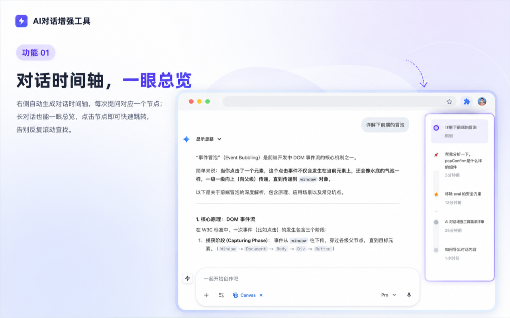
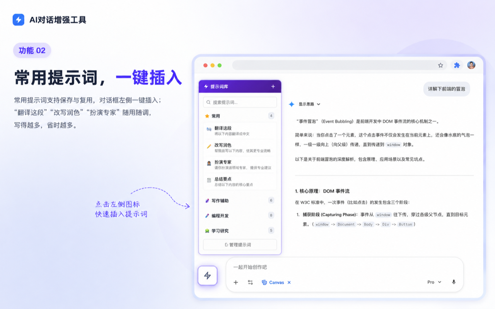
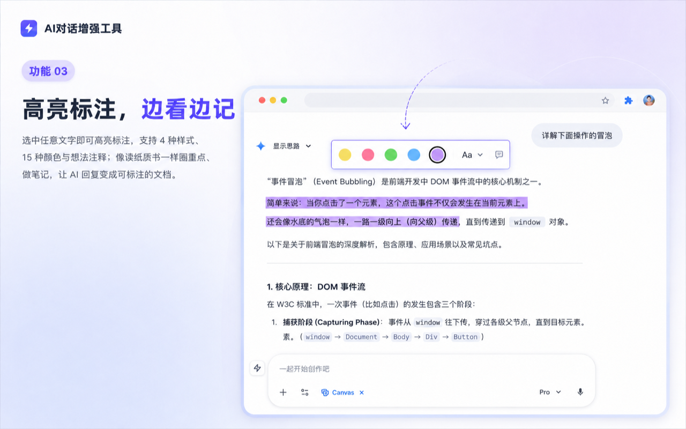
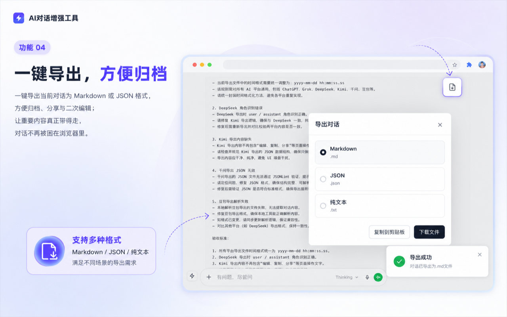

  
  <h1>ChatLine</h1>
  
<strong>浏览器端 AI 对话增强工具</strong> ChatLine 为主流 AI 对话平台提供时间轴导航、内容整理、提示词复用、代码运行与对话归档能力，帮助用户更高效地浏览、管理和复盘 AI 对话。

  

    
    
    
    
    
    
  

  

    
  

  <h4><strong>简体中文</strong> | <a href="./README.en.md">English</a></h4>

## 目录

- [安装方式](#安装方式)
- [功能预览](#功能预览)
- [核心功能](#核心功能)
- [支持平台](#支持平台)
- [数据与隐私](#数据与隐私)
- [本地开发](#本地开发)
- [版本说明](#版本说明)
- [联系与反馈](#联系与反馈)
- [致谢](#致谢)

## 安装方式

推荐通过上方的 Chrome Web Store 安装按钮安装 ChatLine。进入商店页面后，点击「添加至 Chrome」即可完成安装。

安装后打开支持的 AI 对话页面即可使用，无需额外配置。

## 功能预览

### 对话时间轴

自动生成对话节点，长对话中也能快速定位、回看和跳转。

### 提示词管理

保存常用提示词，并从对话页面快速插入，减少重复输入。

### 高亮标注与笔记

对 AI 回复中的关键信息进行高亮、标注和备注，保留重要上下文。

### 对话导出

将当前 AI 对话导出保存，便于归档、分享和二次整理。

### 更多增强能力

围绕阅读、整理、导出和页面显示持续补充实用能力。

## 核心功能

- **对话时间轴**：自动识别对话节点，支持快速定位、回看和跳转。
- **文件夹管理**：对收藏内容、常用资料和对话线索进行分类整理。
- **提示词管理**：保存常用提示词，并支持快速插入使用。
- **代码运行**：增强对话中的代码块查看与运行体验，支持常见代码场景。
- **对话导出**：支持将 AI 对话内容导出保存，便于归档、分享和复盘。
- **高亮标注与笔记**：支持对 AI 回复内容进行重点标注、颜色区分和备注记录。
- **快捷追问**：选中回复内容后快速引用追问，减少复制和来回切换。
- **公式与图表增强**：支持公式源码复制、Mermaid 图表渲染等内容增强能力。
- **页面增强能力**：包括对话宽度、显示优化、回到底部、电子宠物等体验设置。
- **数据备份与恢复**：支持 JSON 导入导出，也可选择使用 Google Drive 同步扩展数据。

## 支持平台

| 平台 | 时间轴 | 文本高亮 | 智能输入 | 输入动画 | 快捷追问 | 提问时间 | 侧边栏收藏 | 回到底部 |
|------|:---:|:---:|:---:|:---:|:---:|:---:|:---:|:---:|
| ChatGPT | ✅ | ✅ | ✅ | ✅ | ✅ | ✅ | ✅ | - |
| Gemini | ✅ | ✅ | ✅ | ✅ | ✅ | ✅ | ✅ | ✅ |
| DeepSeek | ✅ | ✅ | ✅ | ✅ | ✅ | ✅ | ✅ | - |
| Claude | ✅ | ✅ | ✅ | ✅ | ✅ | ✅ | ✅ | - |
| Kimi | ✅ | ✅ | ✅ | ✅ | ✅ | ✅ | ✅ | - |
| 豆包 | ✅ | ✅ | ✅ | ✅ | ✅ | ✅ | ✅ | - |
| 千问 | ✅ | ✅ | ✅ | ✅ | ✅ | ✅ | ✅ | - |
| Qwen 国际版 | ✅ | ✅ | ✅ | ✅ | ✅ | ✅ | ✅ | - |
| Grok | ✅ | ✅ | ✅ | ✅ | ✅ | ✅ | - | - |
| Perplexity | ✅ | ✅ | ✅ | ✅ | ✅ | ✅ | - | - |
| 元宝 | ✅ | ✅ | ✅ | ✅ | ✅ | ✅ | - | - |
| 文心一言 | ✅ | ✅ | - | ✅ | ✅ | ✅ | - | - |
| NotebookLM | - | ✅ | ✅ | ✅ | ✅ | - | - | - |

> 公式复制和代码运行器会在检测到对应内容时自动激活，不依赖特定 AI 平台。

## 数据与隐私

- ChatLine 的核心数据默认保存在用户浏览器本地，主要包括收藏、文件夹、提示词、插件设置、时间标签、笔记等扩展数据。
- 插件不会主动收集、上传或分享用户的对话内容和个人信息；项目代码中也不包含远程采集用户数据的逻辑。
- Google Drive 同步是可选功能，只有在用户主动授权后才会启用，用于备份与恢复扩展数据。
- 本项目已开源，相关数据处理逻辑可直接在仓库中审查。

## 本地开发

本仓库是浏览器扩展项目，没有复杂的前端构建步骤；如需本地开发或调试，可以直接加载源码目录。

Chrome / Edge 调试流程：

1. 打开浏览器扩展管理页面，例如 `chrome://extensions/` 或 `edge://extensions/`。
2. 启用开发者模式。
3. 选择"加载已解压的扩展程序"。
4. 选择本仓库根目录。
5. 修改代码后，在扩展管理页面点击重新加载，并刷新目标 AI 平台页面。

Firefox 调试：

- 打开 `about:debugging`，通过"临时载入附加组件"加载本仓库中的 `manifest.json` 进行调试。

## 版本说明

### v3.7.4

- 对话导出新增「全量导出」和「选择导出」两种模式，选择导出支持在弹框内预览并勾选指定对话内容。
- 选择导出未勾选内容时给出提示，导出完成后自动退出选择状态。
- 优化时间线容器查找逻辑和消息适配。

### v3.7.3

- 新增长对话性能优化功能，支持在 ChatGPT、Gemini、豆包、千问国际版长对话中自动折叠超出范围的历史对话内容。
- 支持自定义触发阈值和页面保留的最近对话数量，减少页面渲染内容，提升长对话加载效率和使用体验。
- 插件设置页面适配暗黑模式，深色环境下显示更清晰。

## 联系与反馈

- **作者**：MiguCHN
- **问题反馈**：欢迎发送邮件到 miguchn@gmail.com

## 致谢

ChatLine 在项目演进过程中参考并受益于 Timeline 开源项目。感谢原作者和社区贡献者的开放分享，也感谢所有持续推动本项目体验优化的反馈与建议。
